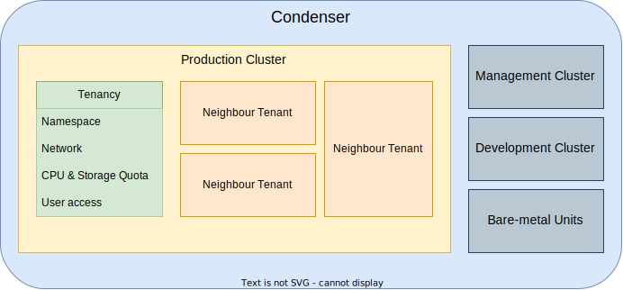

# About the Platform

Condenser is a private cloud platform for research computing at UCL. It provides
a cost-effective, private alternative to public cloud platforms. The platform is
developed and maintained by the [Advanced Research Computing Centre](https://www.ucl.ac.uk/advanced-research-computing/).
All hardware resides in UCL facilities.

## Tenancy

Access to Condenser is organized according to tenancies. Users in a tenancy are provided
with access to a [Kubernetes](https://kubernetes.io/docs/home/) cluster. Users
can deploy virtual machines and related resources with [Harvester](https://docs.harvesterhci.io).
[Rancher](https://rancher.com/docs/) is used to provide access to the cluster.

A tenancy is provided with a namespace to isolate their resources from neighbor
tenants on the same cluster. Each tenancy is also provided with an isolated network.
Resource quotas (CPU, RAM, and data storage) are applied at the tenancy level,
rather than to individual users.

## Sensitive data

As a platform, Condenser is not certified for the secure storage and processing
of sensitive data. However, it is possible to build a secure environment on the
platform. Please consult with us during onboarding, and plan to collaborate with
a Research Data Engineer when planning projects with sensitive data on Condenser.
