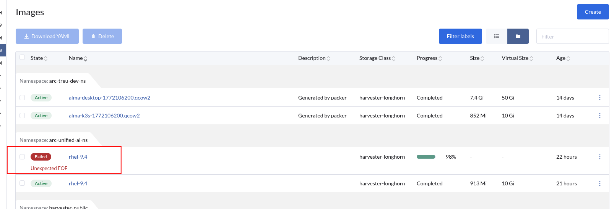

You may get into a situation where an image upload fails or get stuck - but a subsequent upload succeeds:



When you try and delete the 'failed' upload, this also fails:

```
kubectl delete virtualmachineimage <image-id> -n <namespace> <-- will also fail (even if finalizers removed)
```

In this case, you need to remove the successful upload and then the failed one will also disappear.

This is a known 'feature' of Harvester v1.7.1+ - if the display name of a successful image upload is the same as the failed one, Harvester gets into a 'Deadlocked' state - linking both failed and successful uploads to the same image.
